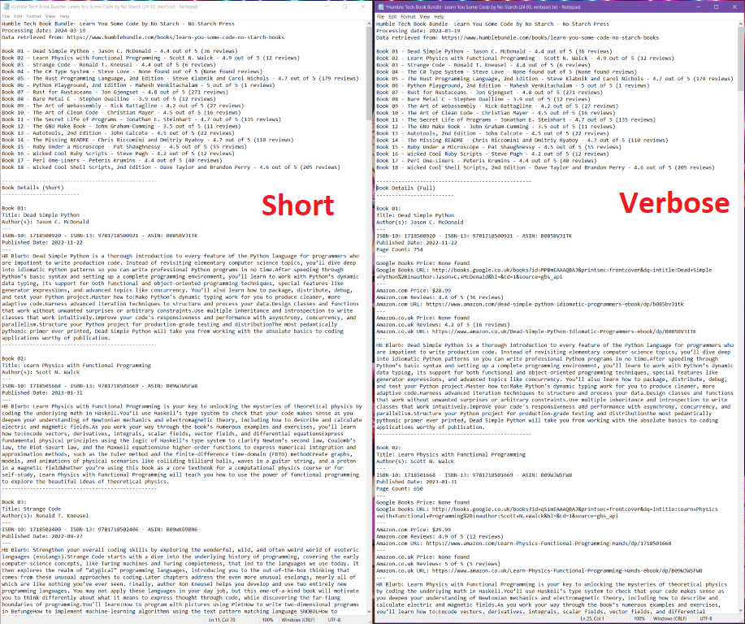

# Humble-Bundle-Book-Info

# Intro 🐲 👋 🐱‍👤
I'm a massive [Humble Bundle Books](https://www.humblebundle.com/books) fan: not only the charity element but that they make some really high quality educational content affordable and digitally accessible.  

Yet, they do put out a lot of content and the quality of the books between Bundles can vary... some Bundles, while fantastic value, can also be a decent nominal outlay. Thus the need to be judicious! This script hopes to replace the time-consuming job of researching each Bundle manually.

Ideally it will help potential HB customers make informed decisions about whether a Bundle is a good buy for them, and I hope this may help Humble Bundle make a few more sales by taking the hassle out of seeing what good value some of their Bundles really are!

_**Important Note: This script does not work for ALL Humble Book Bundles - many RPG ones are not compatible. The script works well for Humble Tech Book Bundles and Fiction bundles. Please see [Limitations Section](#limitations-alt-text) for more details. See examples of which Bundles do / do not work well by viewing past outputs in the [HumbleBookBundles folder.](/HumbleBundleBooks/)**_

# Overview

**What**: The script, coded in 'Novice Python', combines web-scraping techniques to extract and organise individual book data from Humble Bundle Book offerings. 

**How**: It employs [BeautifulSoup](https://beautiful-soup-4.readthedocs.io/en/latest/#) for parsing basic HTML content and [Selenium](https://www.selenium.dev/) for scraping JavaScript-generated content from the Bundle's webpage, extracting titles, authors and blurbs. This data is then enriched with additional details fetched from the [Google Books API](https://developers.google.com/books), such as publication date, ISBN and prices (if available). The script goes on to use the [Bing Search API](https://www.microsoft.com/en-us/bing/apis/bing-web-search-api) to retreive Amazon (co.uk and .com) review ratings, ASINs and (occasionally) prices for the books.

**Output**: The result of these programmatic investigations is a detailed text file containing the collected information about all the books in the Bundle; you can chose to generate the short version, long version or both. 

**Extra**: An additional function can open a new webbrowser page for each of the collected book URLs (Amazon or Google Books Preview) to take you straight to the full product book page (if I buy a bundle I like to add each title to a new ~~Wishlist~~ Reading list.)

_For anyone who wants the Book Bundle info but is put off by needing to set up the Bing Search API Key or Selenium, text outputs for Humble Bundles I have processed are stored in the repo's [HumbleBookBundles](/HumbleBundleBooks/) folder. Skip there if you just want the goodies._

# Program Structure 

* [`hb_book_info_utils.py`](/hb_book_info_utils.py) - all the utility functions.
* [`hb_book_info_main.py`](/hb_book_info_main.py) - main run-point for the script. 
  * Here user should complete the 3 variable values (`url_hb`, `selenium_browser` and `output_directory`).  
  _Usually these would have been migrated to a user_variables file but with so few this approach is neater._
* [`config.py`](/config.py) - Bing Search API key should be entered here. This is also where developers can turn debugging outputs on/off.

## Other files 
[`README.md`](/README.md) - voila!  
[`LICENSE`](/LICENSE) - lgpl-3.0 licence  
[`requirements.txt`](/requirements.txt) - list of all the non-standard Python libraries required for the code to run.  
[/HumbleBookBundles folder](/HumbleBundleBooks/) - text outputs for Humble Bundles that I have processed already.  

# Start / User Setup 
Please read the [Limitations Section](#limitations-alt-text) before attempting to implement the code. To run the script for yourself:
* Install [dependencies](#requirements--dependencies)
* Set-up [Selenium](#selenium-setup) and a [Bing Search API](#obtain-a-bing-search-api-key-🗝) - enter your `bing_api_key` into `config.py`. Please, for your sanity, leave the `debug_flag` as `False`!!
* In `hb_book_info_main.py`, complete the three user variables at the top:
    - `url_hb` (web address of Humble Book Bundle to target)   
    - `selenium_browser` choice  
    - and `output_directory`.  

* Run the code in `hb_book_info_main.py`
* Uncomment the `open_browser_tabs` function and run it (delete the ' #') to open all the book product pages in your browser.

# Requirements & Dependencies
## Install Non-Standard Python Libraries
`pip install beautifulsoup4`  
`pip install requests`  
`pip install selenium`  

## Selenium Setup
Some of the Humble Bundle book data is held within JavaScript on the Humble Bundle webpage, so it is not accessible to simpler tools like `requests`. At present, Selenium is therefore required: if there is any demand for it, my first improvement would be to provide an option for users to provide the full webpage data manually from a brower > Dev Tools > copy body outerHTML > paste txt file, thereby avoiding Selenium setup requirements altogether.

After running `pip install selenium`, you will need to download the appropriate Selenium WebDriver for your browser. Each browser has its own WebDriver.

1. Download the WebDriver executable for your chosen browser:
    * For Chrome: Visit the [ChromeDriver download page](https://chromedriver.chromium.org/downloads), select the version that matches your installed Chrome version, and download the appropriate file for your system.
    * For Firefox: Visit the [GeckoDriver download page](https://github.com/mozilla/geckodriver/releases), and download the appropriate file for your system.

2. Extract the downloaded file (`chromedriver.exe` for Chrome or `geckodriver.exe` for Firefox).

3. Add the WebDriver to your `venv` virtual environment  - _much simpler!_ - or your system's PATH. This allows Selenium to find and use the WebDriver when running your scripts:
   * **Using venv**: Place the WebDriver executable in the Scripts directory of your virtual environment. This directory is automatically added to the PATH when the virtual environment is activated, so the WebDriver will be available without needing to modify the system's PATH.
   * On Windows, **no venv**: Move the executable file to a directory that's in your system's PATH, or add the directory containing the WebDriver executable to your system's PATH. PATH environment variable can be edited via the System Properties > Advanced > Environment Variables dialog.

4. Verify the installation: Open a new command prompt and run `chromedriver` (for Chrome) or `geckodriver` (for Firefox). If the installation was successful, you should see a message indicating that the WebDriver is running.

NB: browser updates are likely to require updating the WebDriver also.

## Obtain a Bing Search API Key 🗝
[Here's the official Microsoft guide.](https://learn.microsoft.com/en-us/bing/search-apis/bing-web-search/create-bing-search-service-resource)

The Bing Search API key is free for limited use ([F1 is 3 calls per second, 1k calls per month](https://www.microsoft.com/en-us/bing/apis/pricing)). However, you do need to jump through the hoops of having a Microsoft account (email) and also an 'Azure Subscription', which itself is free but it's other services are / can be chargable. 

1. Visit the [Azure portal](https://portal.azure.com/).
2. Sign in with your / create a Microsoft account.
3. Once logged in, click on "Create a resource" under the hamburger menu.
4. Search for "Bing Search v7", select the "Bing Search v7" result and click "Create".
5. Fill in the form with the required details:
   - Name: Enter a name for your resource.
   - Subscription: Select your Azure subscription.
   - Resource group: Create a new resource group or select an existing one.
   - Location: Select the location for your resource.
   - Pricing tier: Select 'F1'.
6. Click "Review + create", then "Create" to create the resource.
7. Once the resource is created, go to the "Keys and Endpoint" section.
8. Copy your Bing Search API "Key1" or "Key2" and enter it into `config.py` as the value for `bing_api_key`. Obviously, keep this key secure and never share it.

# Limitations  
1) **Bing**: As mentioned, Bing Search API was the only above-board way to retrieve review ratings from search results. Bing Search API doesn't return exactly the same data as you would see if running the same search term direct from your browser, and - obviously😜 - Bing isn't Google. The data isn't perfect: recency will depend on the API's last scrape date (the script *does* explicitly prioritise newer data), and sometimes the API returns obvious anomalies like "48 reviews with a rating of 0 stars". This is why I've included both Amazon.com and Amazon.co.uk ratings in the verbose version of the output (doubles chance of an accurate review score). It's also why I've included the Amazon and Google Books URLs in the text output, so that you can check the book product pages for yourself. Bing Search API also rarely returns book price data unfortunately.
   
2) **Web-Scraping General**: Web-scraping is always a bit of a gamble: if the Humble Bundle website changes its structure, the script will break: likewise if the Google Books API or Bing Search API change their data structures. Additionally, the scrape is only as good as the data is complete and consistent - there will be errors like the "0 out of 5 stars (48 reviews)" example. I've tried to make the code as robust as possible, but it won't work forever and there will be anomalies. If you're depending on the data for anything important, you should check it manually - use the URLs from the text file (there's a URLs Section with them all together at the end) or use the `open_browser_tabs` function.

3) **Book Bundles**: This only works for Humble *Book* Bundles, not software / video / game bundles.
    
4) **Not all Book Bundles**: This script does not work for ALL Humble Book Bundles - many RPG Bundles are not compatible. For those RPG Bundles the script _can_ process, Google Books doesn't tend to recognise the titles so there can be a lot of missing data. The script generally works well for Humble *Tech* Book Bundles and general Fiction bundles. I have not tested robustly on other types of book Bundle, i.e. Manga, Comics, Gaming etc. If the script is targeted at an incompatible HB webpage, it will return the following message:  
     `Error whilst attempting to write to file: books_data is empty which indicates that no data has been retrieved from even the first interaction with the Humble Bundle Webpage. It is therefore likely that targeted Humble Book Bundle webpage is not in a compatible format for this script, or that the URL is incorrect.` 

# Testing Notes
* Code developed with Python 3.12 on a Windows (10) machine. It should work on other OSs but _I have not tested this_.
* Code has mainly been run on Humble **Tech** Book Bundles (because that is my main interest) - I can't guarantee that this code will work for other types of book Bundle, i.e. Comics, Manga, Gaming etc. The script doesn't like some RPG bundles, though they can be worth a try.
* I haved only tested this code with Firefox directly: I made the code as browser-agnostic as I could, but _I have not tested this_.
* I built the code as robustly as I could, but **I have not had chance to do extensive testing**. Please do let me know what errors you find and I'll do my best to fix them.
* Apologies that the Exception handling is not as extensive as usual, nor are the docstrings complete. There's also a horribly gargantuan function which I'd love to refactor... for now, it works! 😜

# "Choices" Rationale
* [Google Books API](https://developers.google.com/books) because it's simple and free, and I love the fact that the script has been able to retrieve a link to most books' Google Books preview page.
* [Selenium](https://www.selenium.dev/) because some of the Humble Bundle book data is held within JavaScript on the Humble Bundle webpage, so it is not accessible to simpler tools like `requests`.
* [Bing Search API](https://www.microsoft.com/en-us/bing/apis/bing-web-search-api) because it's free for limited use and it's the only legitimate way to retrieve ratings from search results - Google and Bing Search both ban direct webscraping.
* Amazon because it has the most comprehensive book ratings and review data. It also gives the option to create wishlists which can be a good way of cataloguing a reading-list.
* I made the script as simple, as free of cost/signups and as lawfully-compliant as possible... this was the best I could do!

# Main Functions 
In [`hb_book_info_utils.py`](/hb_book_info_utils.py):
* `make_output_directory`: Creates a directory at the user specified path (`output_directory`), if it doesn't already exist. Same operation for debugging folder, if `debug_flag` is set to `True` in `config.py`.

* `hb_webpage_requests`: Fetches HTML content of the user-specified (`url_hb`) Humble Book Bundle webpage without executing JavaScript, using the `requests` library. Returns a BeautifulSoup object for further parsing.

* `hb_webpage_selenium`: Uses Selenium WebDriver to retrieve JavaScript loaded content from the same webpage. The function supports multiple browsers and returns a BeautifulSoup object of the JavaScript-generated content.

* `parse_hb_webpage`: Extracts and parses retrieved book data, such as titles, authors, and blurbs, from both non-JavaScript and JavaScript-generated HTML content. It returns structured data including the Bundle name and publisher.

* `catalogue_book_data`: Organizes the extracted book information into a structured dictionary, setting placeholders for additional data to be filled in by subsequent API calls.

* `google_books_api_call`: Enriches the book data by fetching additional details from the Google Books API, such as publication dates, ISBN numbers, page count, Google Books Preview page URL, retail price. Updates the `books_data` dictionary.

* `bing_search_for_reviews`: Searches for each book via Bing Search API v7 (authenticated via `bing_api_key`) to retrieve URLs, review ratings, and prices from both Amazon.co.uk and Amazon.com (where possible). It returns a dictionary containing the response data for each book.

* `bing_search_for_reviews_parse`: Parses the Bing API Search `response_data` to extract and store Amazon URLs, ASINs, review metrics, and Kindle prices into the `books_data` dictionary.

* `book_data_formatted_txt_verbose`: Generates a detailed (verbose) text file report for all books in the Bundle, including the extensive metadata gathered. There's a shorter summary of Title - Author - Review Rating at the top. A URL Section at the end contains all the URLs for the books, for easy access to the full product pages.

* `book_data_formatted_txt_short`: Generates a concise (short) text file summary of the bundle's books, focusing on a snapshot of the main metadata. A URL Section at the end contains all the URLs for the books, for easy access to the full product pages.

* `generate_txt_file`: A coordinator function that calls either `book_data_formatted_txt_verbose` or `book_data_formatted_txt_short`, or both, based on user selection (`txt_file_version`) to generate the preferred format.

* `main`: The coordinator function that sequentially calls other functions to perform the entire process of data extraction, enrichment, and report generation. It ultimately produces text files with detailed or short book information. The browser tab opening functionality is separated to prevent unwanted execution.

## Optional Function (browser tabs)
This functionality is left commented out to prevent accidental execution. Delete the '# ' before `open_browser_tabs` to allow it to run.

* `open_amazon_uk_urls`: Opens all Amazon.co.uk book URLs gathered in the user's browser, allowing for manual inspection of each book's Amazon.co.uk page.

* `open_amazon_com_urls`: Similar to `open_amazon_uk_urls`, but for Amazon.com URLs. It assists in visually checking book details on Amazon's US website.

* `open_google_books_urls`: Opens all Google Books Preview Links gathered in the user's browser, allowing for inspecting and hopefully previewing each book. 

* `open_browser_tabs`: A coordinator function that calls either `open_amazon_uk_urls` or `open_amazon_com_urls` based on user selection (`uk_or_com_urls`), facilitating quick access to book pages on Amazon for review or purchase considerations.

## Optional: Debugging Facility
In [`config.py`](/config.py), `debug_flag` can be set to `True` to enable COPIOUS text file debugging outputs to be generated during program operation. I'd strongly advise leaving this as `False` unless you've got a sadistic penchant for reading JSON.   
**Important Notes:**
1. Change the `output_directory` to a different folder to avoid overwriting your main Bundle output text files with development versions.
2. If you want to compare debug outputs _between different Bundles_, specify a different subfolder i.e. `.debug/BundleName` for each Bundle you run the script against. Some debug output files have generic names and will overwrite eachother for different Bundles if you leave it pointing at the same folder.

# gorbash1370 Disclaimer 
This is an amateur project built mainly for coding practice, therefore...
* Commentary may appear excessive (learning 'notes')
* Some code is expanded (rather than shortened & simplified) for learning clarity.
* Please always inspect code before running. Use at your own risk!

# Licences
[Licence](/LICENSE) - lgpl-3.0

# If you enjoy this project...
- If you find any bugs or errors, please do let me know.
- Please consider sending me some project feedback or any suggestions for improvement!
- [BuyMeACawfee](https://www.buymeacoffee.com/gorbash1370) ☕

_Last code update 2024-03-19_
